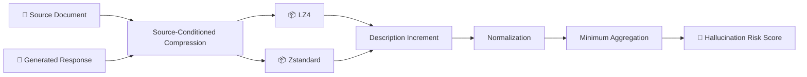

<div align="center">

# 🧩 CompFaith

### Training-Free Source-Conditioned Compression Scoring  
### for Faithfulness Hallucination Detection

<p>
  
  
  
</p>

**A lightweight approach to faithfulness hallucination detection based on source-conditioned lossless compression.**

</div>

---

## 🚀 Overview

Large language models can generate fluent responses that contain information not sufficiently supported by the source document, resulting in **faithfulness hallucinations**.

**CompFaith** explores a lightweight alternative to neural evaluators and LLM-based judges:

> If a generated response is well supported by its source document, the source should reduce the additional information required to describe that response.

Based on this intuition, CompFaith measures the **source-conditioned compression description increment** using general-purpose lossless compressors and converts it into a continuous hallucination risk score.

<div align="center">

### 📦 LZ4 &nbsp;&nbsp; + &nbsp;&nbsp; 📦 Zstandard

</div>

No task-specific training, pretrained evaluator, or LLM inference is required.

---

## ✨ Highlights

- 🧠 **Training-Free** — no task-specific training or fine-tuning
- 🚫 **No LLM Judge** — no prompting, API calls, or LLM inference
- ⚡ **Lightweight** — runs directly on CPU
- 📦 **Compression-Based** — built on general-purpose lossless compressors
- 🔍 **Source-Conditioned** — explicitly captures the relationship between source and response
- 📊 **Continuous Scoring** — produces a hallucination risk score rather than a hard prediction

---

## 🧠 How CompFaith Works

Given a source document $x$, a generated response $y$, and a lossless compressor $k$, CompFaith first computes the source-conditioned compression description increment:

$$
\Delta_k(x,y)
=
C_k(x \Vert y)-C_k(x)
$$

where $C_k(\cdot)$ denotes the compressed description length produced by compressor $k$.

The increment is normalized by the compressed description length of the response:

$$
H_k(x,y)
=
\frac{
\min\left\{
C_k(y),
\max\left(0,\Delta_k(x,y)\right)
\right\}
}{
C_k(y)
}
$$

Finally, CompFaith aggregates the scores produced by **LZ4** and **Zstandard** using minimum aggregation:

$$
H(x,y)
=
\min_{k\in\{\mathrm{LZ4},\mathrm{Zstd}\}}
H_k(x,y)
$$

A larger $H(x,y)$ indicates a higher **faithfulness hallucination risk**.

---

## 🔄 Pipeline



---

## ⚡ Quick Start

Clone the repository:

```bash
git clone https://github.com/gao1948083886/CompFaith.git
cd CompFaith
```

Install the required dependencies:

```bash
pip install -r requirements.txt
```

Run CompFaith:

```bash
python scripts/run_experiment.py \
    --config Code/configs/default_experiment.yaml
```

> **No model download · No API key · No GPU · No fine-tuning**

---

## 📖 Citation

If you find **CompFaith** useful in your research, please consider citing our work:

```bibtex
@misc{gao2026compfaith,
  title  = {CompFaith: Training-Free Source-Conditioned Compression Scoring for Faithfulness Hallucination Detection},
  author = {Gao, Zhenjie and Bao, Feilong and Li, Yuan and Hou, Ruichen and Han, Yibo and Wang, Dabalgan and Ming, Hugjil},
  year   = {2026},
  note   = {Submitted to IEEE ICASSP 2027; under review}
}
```

> Citation information will be updated after publication.
